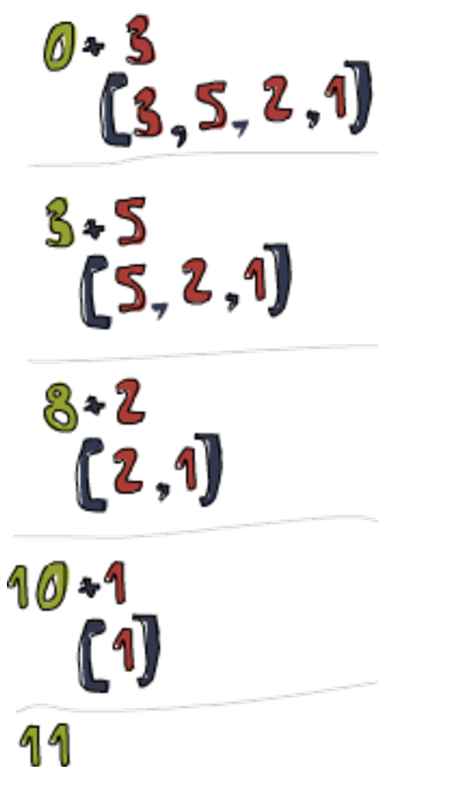

# Haskell Learning Notes

Written by Zhou, UG CS Student at UCL
Reference: Miran Lipovaca, Learn you a Haskell for great good.

# 1.Gets start!

Haskell is a Parallel Computation Language which is widely used by FaceBook and Tesla. It is purely functional and static. You will start a journey of nightmare
if you have learned other modern programming language before...

## Environment/Code editor

let's start configuring the Environment

### Linux(WSL as well, strongly recommended)

install ghci

	sudo apt -install ghci

Professor uses vim

	sudo apt -install vim

Vscode as well

	sudo apt -install code

### Windows

install ghci

	Set-ExecutionPolicy Bypass -Scope Process -Force;[System.Net.ServicePointManager]::SecurityProtocol = [System.Net.ServicePointManager]::SecurityProtocol -bor 3072; try { & ([ScriptBlock]::Create((Invoke-WebRequest https://www.haskell.org/ghcup/sh/bootstrap-haskell.ps1 -UseBasicParsing))) -Interactive -DisableCurl } catch { Write-Error $_ }

install vim (add to the path manually)

	winget install vim.vim

install Vscode

	winget install code

## Compile/Run

	PS> ghci --Enter ghci
	ghci> :l your_program_name --Load the source file
	ghci> your_program_name parameter --Play with the function you have written in source file
	ghci> :q --Leave ghci
	PS> 

## Call Function

Parenthesis doesn't mean the parameter but the priority of execution of functions

		function (x+y)*z

To call function: Function name + space + parameter

		sum [1,2,3,4,5]

Function can not start with uppercase

		Hello xs = ... --Not allowed
		hello xs = ... --Fine

## If-sentence

Not like other language, in haskell, "else" is mandatory

		signum n = if n < 0 then -1 else if n == 0 then 0 else 1

Guarded equations: Similiar to "switch" in C++ and "case" in Python

		signum n | n<0 = -1
				 | n==0 = 0
				 | otherwise = 1

## Function Declaration

Function can be declared like this

	addThree :: Int -> Int -> Int -> Int
	addThree x y z = x + y + z

Curried Function stands for the function takes one argument at a time. First take x then return, then take y and return.

	addTwo :: Int -> (Int -> Int)
	addTwo x y = x + y

Curried Convention stands for the function takes more than one argument at a time

	mult :: Int -> Int -> Int -> Int
	mult x y z = x*y*z
	--Can be considered as (((mult x) y) z)

# 2.Lists

Lists in Haskell

## Lists' Features and Operations:

Store the same type(for all dimensions)

	ghci> let ls = [1,2,3,4]

Use ":" to extend a string

	ghci> 1:[2,3]
	[1,2,3]

Just like C, String is ended with a "\0", written as "[]"

	ghci> 1:2:3:[]
	[1,2,3]

Lists can be compared between the first different element

	ghci> [1,2,3] < [2,3,4] 
	True

Float is not precise in a range

	ghci> [1.1,1.2..10]

Use "!!" to index

	ghci> [1,2,3] !! 0
	1

Use "++" to fix two lists or strings

	ghci> [1,2,3] ++ [4,5,6]
	[1,2,3,4,5,6]

Mutiple dimensions array

	ghci> [[1,2,3], [4,5,6]]

	ghci> [[6,6],[1,2,3,4],[99]]

Use Range to generate value quickly

	ghci> [2,4..20]
	[2,4,6,8,10..20]

	ghci> [20,18..1]
	[20,18,16,14,12,10...]

Use take to cut a list

	ghci> take 2 [2,4..20]
	[2,4]

## List comprehension:

Basic principle

	ghci> [x|x <- [50..100], x `mod` 7 == 3]
	[52,59,66,73,80,87,84]

Can be combined with function

	function_name xs = [...|x <- xs]

For two lists

	[x operator y| x <-[...], y<-[...]]

Multiple constriants

	ghci> let function xs = [x | x <-xs, x `elem`['a'..'z']]
	ghci> let "abcDEF"
	"abc"

Nested List Comprehension. Can be considered as an outer loop and an inner loop.

	ghci> [[1,3,5,2,3,1,2,4,5],[1,2,3,4,5,6,7,8,9],[1,2,4,2,1,6,3,1,3,2,3,6]]
	ghci> [ [ x | x <- xs, even x ] | xs <- xxs]
	[[2,2,4],[2,4,6,8],[2,4,2,6,2,6]]

## Tuples in list:

Fromed by "()", (1,2)...

	ghci> [(x,y) | x <-[1,2,3], y <- [1,2,3]]
	[(1,1),(1,2),(1,3),(2,1),(2,2),(2,3),(3,1),(3,2),(3,3)]

Tuples and Tripes can NOT be existed in one list

	[(1,2), (2,3,4)] --Error
	[(1,2),(3,4)] --Compiled

Tuples are much more rigid because each different size of tuple is its own type

	[[1,2],[3,4]] --less rigid
	[(1,2),(3,4)] --More rigid
		   	   
Elements in Tuples can be heterogenous

	ghci> ("Hi",1,2)
	("Hi",1,2)

# 3. Command/Function/Operator:

Useful command, functions and operators in Haskell

## General

let: define functions in GHCI rather than in the source file

	ghci> let x = [1,2,3]

:t : takes a value, returns the type

	ghci> :t 1
	1 :: Num p => p

"++": Connnects two lists or strings

	ghci> "hello" ++ "world"
	"helloworld"

":": Prepends one element to a string or list

	ghci> 3:[4,5]
	[3,4,5]

"!!": Find the element at this indice

	ghci> "hello" !! 1
	"e"

"/=": Not equal to

	ghci> 1 /= 2
	True

read: takes a string, returns any possible type of value

	ghci> read "1" + 2
	3

".": Merge two functions

	f (g x)
	f . g x

"$": Wait for the completion of right expression

	1 + (1 * 2)
	1 + $ 1 * 2

fromIntegral: takes a int, returns a int/float/double value

	ghci> fromIntegral (length [1,2,3,4]) + 3.2
	7.2 //because 3.2 is float

## List/String/Tuples

head: takes a list, returns the first element of a list

	ghci> head [1,2,3]
	1

tail: takes a list, return the rest elements of a list

	ghci> head [1,2,3]
	[2,3]

last: takes a list, return the last element of a list

	ghci> last [1,2,3]
	3

init: takes a list, return every element but the last element of a list

	ghci> init [1,2,3,4,5]
	[1,2,3,4]

length: takes a list, return the length of a list

	ghci> length [1,2,3]
	3

null: takes a list, check whether a list is empty

	ghci> null [1,2,3]
	ghci> True

reverse: takes list, returns a reversed list

	ghci> reverse [1,2,3]
	ghci> [3,2,1]

take: takes an int and a list, return the first int element of a list

	ghci> take 10 [1..10]
	1,2,3,4,5,6,7,8,9,10

drop: takes an int and a list, return except the first int element of a list

	ghci> drop 5 [1..10]
	6,7,8,9,10

cycle: takes a list and repeat it, combined with take
	
	ghci> take 10(cycle [1,2,3])
	[1,2,3,1,2,3,1,2,3,1]

repeat: Same as cycle but only takes one element

	ghci> take 10 (repeat 1)
	[1,1,1,1,1,1,1,1,1,1]

maximum/minimum: takes a list, return the max or min value in a list

	ghci> maximum [2,3,4]
	4

sum: takes a list, return the sum of a list

	ghci> sum [1,2,3]
	6

product: takes a list, return the product of a list

	ghci> product [10,10,10]
	1000

elem: takes a value, check whether the element is inside the array

	ghci> 4 `elem` [3,4,5,6]
	True

fst: takes a tuple, return the first element

	ghci> fst (2,3)
	2

snd: takes a tuple, return the second element

	ghci> snd (2,3)
	3

zip: takes two lists, join them together as one list of tuples

	ghci> zip [1..]["Orange", "Apple", "Banana"]
	[(1,"Orange"),(2,"Apple"),(3,"Banana")]

# 4.Type

int and integer are different data types

Integer can store really big number

	2147483647 //Maximum of int
	? //Maximum of integer

## List Type

A list with elements of same type can be declared like

	[False,True,False]::[Bool]

Howeveer, a Tuple needs to be declared respectively

	('c', False) :: (char, Bool)
	(1,2) :: (Int, Int)

## Type variables

function "length" returns the length of any list, no matter which type of this list is

	ghci> length [False, True]
	2

	ghci> length [1,2]
	2

Type variables is used when a variable doesn't necessarily need a determined type

	length :: [a] -> Int --Use a to replace the type name as We don't care what type it is.

Another instance, function "fst", the tuple can be of any type

	fst :: (a,b) -> a

Another instance, function "take", which returns a list. The type of this list can be of any type.

	take :: int->[a]->[a]

## Type class

Not like the class in OOP

	//Not like this...
	class Cat{
	private:
		name;
	public:
		Cat(string n): name(n) {}
		string print_name(){
			std::cout << name << "\n";
		}
	};

Can be considered as an extension of Type variable. We only need the type to be in a "class" but do not need it to be determined. Just like the operatpr "+", we can add float number as well as integer number. We only need it to be a "number" but don't need it to be a certain type. To be a "number" means you are in the "number" class, which is "Num" class.

	ghci> :t (+)

	(+) :: (Num a) => a->a->a

So, type class is More like a big dictionary, kind of a constriant on possible types.

Eq class (Types that can be equal to each other)

	ghci> :t (==)

	(==) :: (Eq a) => a -> a -> Bool
	--a can be of type in class "Eq"

Ord class (Types that can be ordered)

	ghci> :t (>)

	(>) :: (Eq a) => a -> a -> Bool

Read class (Types that can be read)

	ghci> :t read

	read :: (Read a) => string -> a
	--a only needs to be of any type inside class "Read"

Enum class (Types that can be ranged)

	['A'..'D'] --character is in Enum class
	[1..10] --int is in Enum class

Num class

	[1..10] --int
	[1.1,1.2,10] --float

Show class

	['A'..'D'] --Types that can be showed

## Static Types

Data Types in Haskell are defind during compile time, which means they are all static and can not be modified during runtime

Static type checking is used in Haskell.

No data type will be defined in the free store

## Type annotations

Some functions can be declared while being called

	ghci> read "5" :: int
	5
	ghci> read "5" :: float
	5.0

# 5.Partial Function

In haskell, every function takes more than 1 argument is implemented by "paritial function". Paritial function means, whatever that function is, 
there are only two arguments playing with each other.

	ghci> max A B --You see this...max and A and B?
	ghci> (max A) B --Actually it is like this...only (max A) and B

In the other word, every function in Haskell officially only takes one parameter, which is why the declaration of max is like this

	ghci> :t max
	ghci> max :: Ord a => a -> a -> a

In this case, we can understand the expression in the other way

	max :: Ord a => a-> (a-> a)
	--This means, this function takes one pratmeter and returns function

So we can say that, (max A) is a function, and B is the parameter

	(max A) B --max A is the function we created

Now, let's see another example

	multThree :: (Num a) => a -> a -> a -> a
	multThree x y z = x * y * z

This function actually creates two more function, say, for 3 parameters, 2, 9, 10

	multThree 2 9 10
	step1: multThree 2
	step2: multipy 9 with (multThree 2)
	step3: multipy 10 with (multipy 9 with (mult Three 2))

Remeber a function only takes one argument, and returns a value or function, whatever.
So, we know a function can return a function, so actually we don't really have to give paramter to a function!

	compareWithHundred :: (Num a, Ord a) => a->a->Ordering
	compareWithHundred x = compare 100 x

	--This function is totally the same as the following one

	compareWithHundred = compare 100

	--Let me make this clear
	--Whenever you call compareWithHUndred, it returns compare 100
	--So, compraeWithHundred x is compare 100 x
	--The only difference is that this x is not for compareWithHundred, but for compare

Depending on this, we can something more crazy

	divideByTen :: (Floating a) => a->a
	divideByTen = (/10)
	ghci> 200 divideByTen
	20

## Lambda Expression

A function which can be called without a name is called Lambda Expression

	\x -> x+1

This function takes a number x and returns a value equals to x + 1. The reason we need Lambda Expression is that, we can directly write the body
of function in the expression. You don't need to write this function elsewhere.

	ghci> (\x->x+1) 5
	6

	--You don't need write a function which returns x+1 in some other place

Lambda Expression also gives a formal implementation to these functions that take more than 1 arguments
through partial function

	add x y = x + y
	add = \x -> (\y -> x + y)

It is useful to use Lambda Expression to define functions that return function, still some paritial function thing

	--Simple way
	compose f g x = f(g x)

	--Lambda Expression, more nature
	compose f g = \x -> f(g x)

# 6.Pattern Matching

In C, if we want to check whether the input number is 7

	int check(int a){
		if(a == 7){
			return 1;
		}
		return 0;
	}

In Haskell, we can use Pattern Matching to do that

	check :: (Integral a) => a -> String
	check 7 = "That is!" --specify what would happen at 7
	check x = "No"

You can consider it as a case sentence as well

	sayyou :: (Integral a) => a -> String
	sayyou 1 = "sayme" --specify what would happen at 1
	sayyou 2 = "say it always"
	sayyou 3 = "the way it should be"
	sayyou x = "sayme"

The "else" pattern must be at the bottom

	sayyou x = "sayme"

The Pattern Matching is, to specify the part of the function we want and use it.

The Pattern Matching in tuples

	third :: (a,b,c) -> c
	third (_,_,c) -> c --Use _ means we don't care and won't use that parameter
	--We want c, so only specify c and then use it

	addTwo :: (Integral a) => (a,a) -> (a,a) -> (a,a)
	addTwo (x,y) (x2,y2) = (x+x2, y+y2)
	--We want the individual value so specify them

The Pattern Matching can be used in List Comprehension

	findSum xs = [a+b | (a,b) <- xs] --We want the individual value of a and b so specify them

	ghci> findSum [(1,2), (3,4)]
	[3,7]

The Pattern Matching in List Operation

	head' :: [a] -> [a]
	head' [a:_] = [a] --Specify the first element and leave the rest elements unspecified

	ghci> head' "Hello"
	"H"

	tell :: [a] -> (Show a) => [a] -> String
	tell [] = "No element"
	tell (a:[]) = "One element"
	tell (a:b:[]) = "Two element"
	tell (a:b:_) = "More than 3 element" --Only specify the first two elements and leaves the rest unspecified 

	ghci> tell [1,2]
	"Two element"

# 7.Recursion

The simpest Recursion can be implemented through Pattern Matching

	factorial :: (Integral a) => a -> a
	factorial 0 = 1 --base case
	factorial x = x * factorial (x-1) --general case

What happened?

	factorial 3
	= 3 * factorial 2
	= 3 * (2 * factorial 1)
	= 3 * (2 * (1 * factorial 0))
	= 3 * (2 * (1 * 1))
	= 3 * (2 * 1)
	= 3 * 2
	= 6

You should know, haskell is the best language to write a qsort. It is very simple, much easier than in any other language.

	qsort :: (Num a) => [a] -> [a]
	qsort x:xs = qsort[a | a <- xs, a <= x]
					++ x ++
					qsort[b | b <- xs, b > x]
					
	--Try implement this using C++ and you will love Haskell for a little while

Now use recursion to implement a function which sums up every single value. Here we mentioned the foldr, you are not required to understand
it so far. But we will get back to this in later chapter!

	sum[] = 0
	sum(x:xs) = x + sum xs

	--Using foldr (fold right)
	sum = foldr(+)0

Implementation of function product

	product[] = 1
	product(x:xs) = x * product xs

	--Using foldr
	product = foldr(*)1

Implementation of function and

	and[] = True
	and(x:xs) = x && add xs

	--Using foldr
	and = foldr(&&)True

Implementation of foldr, I know it is hard to understand. You just need to know that there is a function called foldr
and it is being used damn frequently.

	foldr::(a->b->b) ->b ->[a] ->b

	--"?" is an operation like +, -, *, /
	foldr (?) v[] = v
	foldr (?) v(x:xs) = x ? foldr (?) v xs

Although you don't really understand foldr, you still need to know the principle of Recursion is to change the operation ":" to 
another operation, For instance

	sum[123]
	=foldr(+)0 [1:(2:(3:[]))]
	=1 + foldr(+)0(2:(3:[]))
	=1 + (2 + foldr(+)0(3:[]))
	=1 + (2 +(3 + foldr(+)0[]))
	--":" becomes "+"

More Complex Recursion function, a function that sums up the square of the positive numbers in a list

	f :: [Int] -> Int
	f[] = 0
	f(x:xs) | x>0 = (x*x) + f xs --if x > 0 then sums up the square.
			| otherwise = f xs

Back to the foldr, we now know it change the operation into another operation. How about using ":" instead of "+" ?

	foldr(:) [] xs
	--No change, it replaces ":" with ":". Hence Nothing is being replaced

Tail Recursive & Non-Tail Recursive. The difference is whether you are using the return value of the recursion function
or you are using a value you sumed up all on yourself.

	factorial (n, acc) --Tail recursive
	factorial (1), acc = 1 * 2 * 3 --return acc
	factorial (2), acc = 1 * 2
	factorial (3), acc = 1

	factorial (1) = 1 --Non-tail recursive
	factorial (2) = 2 * factorial (1)
	factorial (3) = 3 * factorial (2) --Return factorial(3)

# 8.Higher-Order Function

Function that takes another function as parameter, for instance, function map takes a function and functions this function on every single elements inside one list

	ghci> map(+1)[1,3,5,7]
	[2,4,6,8]

We can see the Implementation of function map, there are many ways to do it

	map :: (a->b) ->[a] ->[b]
	--(a->b) stands for taking a function

	--List comprehension method
	map f xs = [f x|x <- xs]

	--Recursion method
	map f[] = [] //base case
	map f(x:xs) = f x:map f xs --general case

	--Tail Recursion with Lambda expression
	map f = foldr(\x acc -> f x : acc) []

Function filter, quite similiar to map, it filters a list depending the boolean value which is returned from the function took from input.

	filter::(a->Bool) -> [a] -> [a]
	ghci> filter even [1..10]
	[2,4,6,8,10]

Implementation of function filter, still a lot of ways to do it.

	--List comprehension method
	filter p xs = [x|x<-xs, p x]

	--Recursion method
	filter p[] = []
	filter p (x:xs)
	|p x = x:filter p xs
	|otherwise = filter p xs

Combined with recursion, this is a function sums up the square of the positive value inside a list

	f :: [Int] -> Int
	f xs = foldr(+)0 (map sqr (filter pos xs))
			where
				sqr x = x*x
				pos x = x>0

Recursion and Higher order function, that is great, we can combine them to do something more useful. We can implent the function zipWith like this...

	zipWith' (a->b->b) ->[a] ->[b] ->[b]
	zipWith' _ [] _ =[]
	zipWith' _ _ [] = []
	zipWith' f x:xs y:ys = f x y : zipWith' xs ys

	--Use recursion to spilt every two value, functions these two value, pushs them to the return list, and functions next two values...

More complex example, find the largest number under 100,000 that's divisible by 3829

	findLargest :: (Integral a) => a
	findLargest = head(filter p[1..100000])
		where
			p x = x `mod` 3829 == 0

	--You know how to use Lambda Expression instead of where

Let's introduce another useful function called takeWhile, this function will take a list until reaching a breakpoint, for example...

	ghci> takeWhile (<10) [1..]
	[1,2,3,4,5,6,7,8,9]

And we can use it to operate a list with a strict in range

	ghci> sum (takeWhile (<10000) (filter odd (map (^2) [1..])))
	166650

	--Just remeber this function, it will not be used too frequently

## Fold

Fold is a very important idea based on Higher Order Function and Recursion, which is one of the most intriguing thing in Haskell. There are functions
related to Fold, foldl and foldr. First let's see an example of foldl

	sum' :: (Num a) => [a] -> a
	sum' xs = foldl (\acc x -> acc + x) 0 xs

	--foldl takes a Lambda Expression, a value and a list

The Lambda Expression tells the function that the way we accumulate the value is through "+", not "-" or something else. The value tells the function that 
the base case is returning a 0. The list is the list we input as the parameter. We can see an example

	--How does (\acc x -> acc + x) works?
	ghci> sum' [3,5,2,1]
	11

See the picture, you will find that acc is the place where we store our value. It tells every circle of recursion what we have, and then every recursion
will operate this acc depending on the Lambda Expression. The acc is first 0,then 3, then 8 and so on. And the reason why acc is before the x, is that, 
in this case, we start folding the list from left(you can see it on the picture), so acc should be always at the left of the value to be added up.

	foldl (+) 0 xs
	--We can simpily this function like this

To build a deeper understanding on foldl, we can see another example. 

	elem' Eq a -> a -> [a] -> Bool
	elem' y ys = foldl (\acc x = if x == y then True else acc) False ys

	--This function means, firstly we are False, and then we compare with first element, if not equal then keep false and try next one.
	--When we get out of the iteration, if we are still false, that means no this element. And if we ever get True, the True will be kept too.

foldr is another folding function, the difference from foldl is that, foldr starts folding from the right, which means that the accumulator "eats" the element from right hand side, rather than left hand side. And that's why we need to write "\x acc ->" rather than "\acc x ->" because acc is "eating" x from right. Here is the implementation of function map. We start folding a list from right with initial value a empty list.

    map' :: (a->a) ->[a] ->[a]
    map' f xs = foldr(\x acc -> f x : acc) [] xs

    --You can still think of the picture above, imagining the acc is started from right hand side

"Folds can be used to implement any function where you traverse a list once, element by element, and then return something based on that. Whenever you want to traverse a list to return something, chances are you want a fold." Beside foldr and foldl, there are also foldr1 and foldl1. The only difference is that they don't need an initial value. They take the leftest or rightest element as the initial value, which would fully depend on the list itself rather than the User input.

    sum' :: (Num a) => [a] -> a
    sum' xs = foldl1 (\acc x -> acc + x ) xs

Here are some examples of functions implemented by fold in standard library

    maximum' :: (Ord a) => [a] -> [a]
    maximum' xs = foldl1(\acc x -> if x > acc then x else acc) xs

    filter' :: (a->Bool) -> [a] -> [a]
    filter' f xs = foldr (\x acc -> if f x == True then x : acc else acc) [] xs

And then we can introduce the function scanl and scanr, they are mostly the same as foldr and foldl. The difference it that they report every stage of acc. This can help you understand how the fold works in a more visual way.

    ghci> scanl (+) 0 [3,5,2,1]
    [0,3,8,10,11]

    ghci> scanr (+) 0 [3,5,2,1]
    [11,8,3,1,0]

Using scan we can figure out some values related to some statistics thing, let's say, figuring out how many root of natural numbers does it take to sum over 1,000? We can do this...

    sqrtSums :: Int
    sqrtSums = length (takeWhile (<1000) (scanl1 (+) (map sqrt [1..]))) + 1

    --We have to add 1 because our takeWhile is less than 1000.
    
    ghci> sqrtSums
    131
    ghci> sum (map sqrt [1..131])
    1005.0942035344083
    ghci> sum (map sqrt [1..130])
    993.6486803921487

## Function Application

Function Application is a easy way to minimize your coding. Using the "$" operator, you can easily "put things together". For example, when you write sum (map (+1) [1..10]), you have to include a parenthesis, which is quite annoying. But with $, you can do this. It is more like a parenthesis that you don't need to parenthesis back.

    sum $ map (+1) [1..10]

You will see a lot of $ in your following study but keep in mind that they are just parenthesis. Everytime things get complex you can try to convert the $ to parenthesis.

## Function Composition

Besides "$", here is another operation that you will see a lot, which is ".". It is just a simple dot. The function of this dot is to "combine two function together". You have likely ever considered to write a composition of function like f(g(x)) when doing mathematics. And in Haskell it is the same. You are going to write f g x. But with this dot you can write it in another way

    ghci> f g x

    --is the same as...

    ghci> (f . g) x

Comparing with a Lambda Expression we can understand this dot more deeply.

    ghci> map (\x -> negate (abs x)) [5,-3,-6,7,-3,2,-19,24]
    [-5,-3,-6,-7,-3,-2,-19,-24]

    --is the same as...

    ghci> map (negate . abs) [5,-3,-6,7,-3,2,-19,24]
    [-5,-3,-6,-7,-3,-2,-19,-24]

We can simple translate the dot to "First do the function at the right hand side and then do the function at the left hand side". Just like the example above, we first apply the abs and then apply the negate. As the dot returns a function, of course we can use mulitple dot at the same time!

    ghci> map (\xs -> negate (sum (tail xs))) [[1..5],[3..6],[1..7]]
    [-14,-15,-27]

    --is the same as...

    ghci> map (negate . sum . tail) [[1..5],[3..6],[1..7]]
    [-14,-15,-27]

Now, a simple challenge! Try write this function using function composition sum (replicate 5 (max 6.7 8.9)). We can partial the function in order. First do sum, and do replicate 5 and then do max 6.7 8.9. Now we head back like a recursion, we do max 6.7 8.9 so we can write them as max 6.7 $ 8.9. And then we do replicate 5 so we put a dot between replicate and sum. Then we do sum so we again put a dot between sum and replicate.

    sum . replicate 5 . max 6.7 $ 8.9

This is useless though, just a little task to pratice your understanding on the dot. The technique we use the dot is called Function Composition.

### A word

We can consider both Function Composition and Function application as "a way to replace the parenthesis". But keep in mind that, $ is for arguments and . is for functions.

# 9.User-Defined Data type

The next chapter we will learn is User-Defined Data type, which could be the most annoying! In Haskell there are two differernt style to define your own data type. One is more like the struct and another one is more like to build a Class.

## Using type

keyword "type" can be used to Rename an existed data type. By following code we are able to use String to replace [Char]. 

	type String = [Char]

keyword "type" can be used to simpilify a data type, for instance, a tuple of int

	type Pos = (int,int)

	origin:: Pos
	origin = (0,0)

"type" can have parameter, it is just a type not a constructor

	type Pair a = (a,a)

	copy:: a -> Pair a
	copy x = (x,x)

## Using data

keyword "data" is more widely-used! We can use this to define every single data type inside the standard library. Looking at the code below, we are saying that a data type Bool can be either False of True. "False" and "True" are so called constructor which will be discussed further.

	data Bool = False | True
	--Bool is a new type with value False or True

Keep in mind that Type and constructor name must start with a Upper-case letter

	data Bool = False | True --compiles
	data bool = false | true --error

Now we can consider the following example. At the first glance you will find it really weird. But we will explain it step by step. Here we want to build a type called shape, while the shape can be circle or rect or anything else though we only write down the circle and rect. The thing is, we know a Shape class can contains different detail, whatever it is, circle or rect. And they are different in their implementation. Here "Circle" and "Rect" are constructors, it takes his parameter and returns a value. And when we write functions, or may say, his method. We can use pattern matching to implement the polymorphism. I am using the slogan in OOP but it is something like OOP just help you understand!

	data Shape = Circle Float | Rect Float Float
	--Shape can be etiher Circle with one parameter or Rect with two parameters

	area :: Shape -> Float

	area Circle r = pi * r * r
	--Contruct a circle and calculate its area

	area Rect x y = x * y
	--Construct a rectangle and calculate its area

Circle and Rect can be viwed as the Constructors in modern programming language

    //C++
	class Circle{
	private:
		int r;
	public:
		Circle(int r): r(r) {}

		Circle getCr(int r){
			Circle cr = Circle(r);
			return cr;
		}

	};
    //polymorphism is not implemented in this code. 
    //You should use virtual function to implement it.
    //First write a pure virtual class, say, Shape
    //Then write concrete class like Circle and Rect which inherits from the shape
    //Then implement the virtual function written in Shape

Now we can see an example of using the Constructor

	ghci> area Rect 10 20
	200

	--Rect 10 20 returns data type "Rect"

As we know constructors are function, it can be used in some higher order function like map

	ghci> map Rect 10 [10,20,30,40,50]
	[Rect 10 10, Rect 10 20, Rect 10 30, Rect 10 40, Rect 10 50]

## Recursive Types

Types can be recursive, say, be defined by its own

	data Nat :: Zero | Succ Nat
	--Nat is a Set of natural number, from Zero to positive infinite

Use recursive types to convert between Nat and Int

	nat2int :: Nat -> Int
	nat2int Zero = 0
	nat2int (Succ n) = 1 + nat2int n

	int2nat :: Int -> Nat
	int2nat 0 = Zero
	int2nat n = Succ (int2nat (n-1))

Use recursive types to add two Nats

	add :: Nat->Nat->Nat
	add Zero n = n
	add (Succ m) n = Succ (add m n)
	-- (m + 1) + n = + 1 + (m+n)

Use recursive types to multiple two Nats

	mul ::Nat ->Nat ->Nat
	mul Zero _ = Zero
	mul (Succ m) n = add n (mul m n)
	-- (m+1) * n = n + (m*n)

## Get together: Implementation of Binary Tree

Using haskell, a binary tree can be much eaiser to be implemented. First, delcare the Tree type

	data Tree = leaf a
				| Node (Tree a ) a (Tree a)
	--Can be either leaf, or node surrounded by either other nodes or tree

Try using the tree

	t :: Tree Int
	t = Node (leaf 2) 1 (leaf 3)
	--A little tree with only 3 elements

# 10. I/O

This chapter we will go through the Haskell Input/Output. Here is a simple code of Hello World program in haskell. And then save the document as hello.hs

	main = putStrLn "hello world!"

Then we need to compile it, using the command below

	ghc --make hello

Now the hs file is compiled we can then run it

	./hello

Something interesting is the type of this function putStrLn. You will find this when you print out its type. IO stands for input and output. And the parenhesis after IO is because there is not a real value should be returned in the output stream.

	ghci> :t putStrLn
	String -> IO()

keyword "do" can be used to write multiple sentences and let them be perferomed from top to bottom just like the modern programming language.

	main = do
		putStrLn "hello, what's your name?"
		name <- getLine
		putStrLn $ "Hello " ++ name ++ "you rock!"

Notice this sentence, we are using an operator "<-", which may be little bit unfamiliar. We use this operator because <- doesn't really return a string value. If you use :t on it you will find it return an IO String and the way we fetch data from an IO object is to use "<-"

	name <- getLine

In the same way, we can try to fetch data from an IO(). As it is () but not String or Int so the data we are fetching is empty. For example,

	emp <- putStrLn "Hello"

Things can get even more complex when you realize that main function can call itself like a recursion or loop. The following program will continue get input from user and reverse it and then give it back, until a blank is typed in. Notice the "return" is nothing like the "return" in any other language. "return" in Haskell is a way we avoid interacting with IO as IO is unsecure (You may typed something wrong). And the reason why this program stops at return() is simply because we are not doing the main in else.

	main = do 
    line <- getLine
    if null line
        then return ()
        else do
            putStrLn $ reverseWords line
            main

	reverseWords :: String -> String
	reverseWords = unwords . map reverse . words

Furthermore, we can say that "return" encapsulates a normal data into the IO and "<-" fetches the normal data from the IO. The following code is totally making sense. But this is not how we use them, you should use a "let" instead, which is more efficient and readable. This is just an example.

	main = do
		a <- return "hell"
		b <- return "yeah!"
		putStrLn $ a ++ " " ++ b

