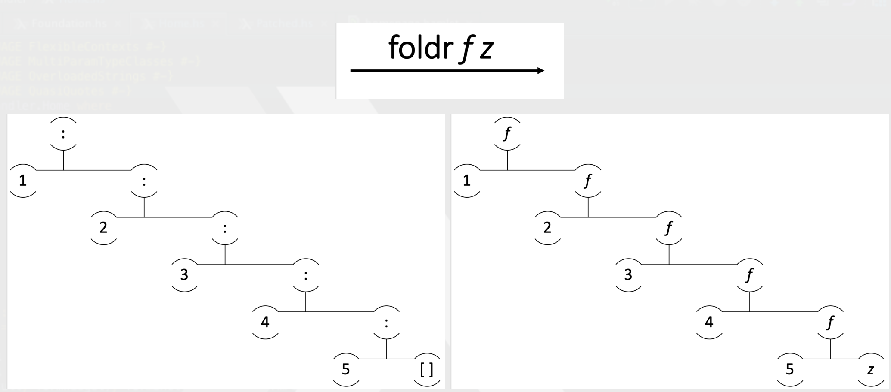
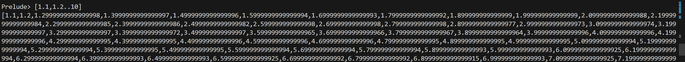

# Haskell Learning Notes

Written by Zhou, UG CS Student at UCL
Reference: Miran Lipovaca, Learn you a Haskell for great good.

# 1.Principles
Haskell is a Parallel Computation Language which is widely used by FaceBook and Tesla.

## Environment/Code editor

install ghci

		sudo apt -install ghci
		//I don't really remember this

Professor uses vim

		sudo apt -install vim

Vscode as well

		sudo apt -install code
		//I don't really like it for haskell

## Compile/Run

		ghci //Enter ghci
		ghci> :l your_program_name //Load the source file
		ghci> your_program_name parameter //Play with the function you have written in source file
		:quit //Leave ghci

## Basic

Parenthesis doesn't mean the parameter but the priority of execution of functions

		function (x+y)*z

To call function: Function name + space + parameter

		sum [1,2,3,4,5]

Function can not start with uppercase

		Hello xs = ... //Not allowed
		hello xs = ... //Fine

## If-sentence

Not like other language, in haskell, "else" is mandatory

		signum n = if n < 0 then -1 else if n == 0 then 0 else 1

Guarded equations: Similiar to "switch" in C++ and "case" in Python

		signum n | n<0 = -1
				 | n==0 = 0
				 | otherwise = 1

## Function Declaration

Function can be declared like this

		addThree :: Int -> Int -> Int -> Int
		addThree x y z = x + y + z

Curried Function stands for the function takes one argument at a time. First take x then return, then take y and return.

		addTwo :: Int -> (Int -> Int)
		addTwo x y = x + y

Curried Convention stands for the function takes more than one argument at a time

		mult :: Int -> Int -> Int -> Int
		mult x y z = x*y*z
		//Can be considered as (((mult x) y) z)

## Lambda Expression

A function which can be called without a name is called Lambda Expression

		\x -> x+1

This function takes a number x and returns a value equals to x + 1. To call this function:

		ghci> (\x->x+1) 5
		6

Gives a formal meaning to these functions that are defined using currying

		add x y = x + y
		add = \x -> (\y -> x + y)

Useful to define functions that return function

		//Simple way
		compose f g x = f(g x)

		//Lambda Expression, more nature
		compose f g = \x -> f(g x)

## Pattern Matching

In C, if we want to check whether the input number is 7

		int check(int a){
			if(a == 7){
				return 1;
			}
			return 0;
		}

In Haskell, we can use Pattern Matching to do that

		check :: (Integral a) => a -> String
		check 7 = "That is!" //specify what would happen at 7
		check x = "No"

You can consider it as a case sentence as well

		sayyou :: (Integral a) => a -> String
		sayyou 1 = "sayme" //specify what would happen at 1
		sayyou 2 = "say it always"
		sayyou 3 = "the way it should be"
		sayyou x = "sayme"

The "else" pattern must be at the bottom

		sayyou x = "sayme"

The Pattern Matching is, to specify the part of the function we want and use it.

The Pattern Matching in tuples

		third :: (a,b,c) -> c
		third (_,_,c) -> c //Use _ means we don't care and won't use that parameter
		//We want c, so only specify c and then use it

		addTwo :: (Integral a) => (a,a) -> (a,a) -> (a,a)
		addTwo (x,y) (x2,y2) = (x+x2, y+y2)
		//We want the individual value so specify them

The Pattern Matching in List Comprehension

		findSum xs = [a+b | (a,b) <- xs] //We want the individual value of a and b so specify them

		ghci> findSum [(1,2), (3,4)]
		[3,7]

The Pattern Matching in List Operation

		head' :: [a] -> [a]
		head' [a:_] = [a] //Specify the first element and leave the rest elements unspecified

		ghci> head' "Hello"
		"H"

		tell :: [a] -> (Show a) => [a] -> String
		tell [] = "No element"
		tell (a:[]) = "One element"
		tell (a:b:[]) = "Two element"
		tell (a:b:_) = "More than 3 element" //Only specify the first two elements and leaves the rest unspecified 

		ghci> tell [1,2]
		"Two element"

## Recursion

Recursion can be implemented through Pattern Matching

		factorial :: (Integral a) => a -> a
		factorial 0 = 1 //base case
		factorial x = x * factorial (x-1) //general case

What happened?

		factorial 3
		= 3 * factorial 2
		= 3 * (2 * factorial 1)
		= 3 * (2 * (1 * factorial 0))
		= 3 * (2 * (1 * 1))
		= 3 * (2 * 1)
		= 3 * 2
		= 6

Implementation of quick sort

		qsort :: (Num a) => [a] -> [a]
		qsort x:xs = qsort[a | a <- xs, a <= x]
					 ++ x ++
					 qsort[b | b <- xs, b > x]
					 
		//Try implement this using C++

Implementation of function sum

		sum[] = 0
		sum(x:xs) = x + sum xs

		//Using foldr (fold right)
		sum = foldr(+)0

Implementation of function product

		product[] = 1
		product(x:xs) = x * product xs

		//Using foldr
		product = foldr(*)1

Implementation of function and

		and[] = True
		and(x:xs) = x && add xs

		//Using foldr
		and = foldr(&&)True

Implementation of foldr

		foldr::(a->b->b) ->b ->[a] ->b

		//"?" is an operation like +, -, *, /
		foldr (?) v[] = v
		foldr (?) v(x:xs) = x ? foldr (?) v xs

Principle of Recursion is to change the operation ":" to another operation, For instance

		sum[123]
		=foldr(+)0 [1:(2:(3:[]))]
		=1 + foldr(+)0(2:(3:[]))
		=1 + (2 + foldr(+)0(3:[]))
		=1 + (2 +(3 + foldr(+)0[]))

More Complex Recursion function, a function that sums up the square of the positive numbers in a list

		f :: [Int] -> Int
		f[] = 0
		f(x:xs) | x>0 = (x*x) + f xs //if x > 0 then return...
				| otherwise = f xs

Brainstorm: What's the meaning of this function?

		foldr(:) [] xs
		//No change, just return the exact xs

## Higher-Order Function

Function that takes another function as parameter, for instance, function map 

		ghci> map(+1)[1,3,5,7]
		[2,4,6,8]

Implementation of function map

		map :: (a->b) ->[a] ->[b]
		//(a->b) stands for taking a function

		//List comprehension method
		map f xs = [f x|x <- xs]

		//Recursion method
		map f[] = [] //Pattern matching
		map f(x:xs) = f x:map f xs

Function filter

		filter::(a->Bool) -> [a] -> [a]
		ghci> filter even [1..10]
		[2,4,6,8,10]

Implementation of function filter

		//List comprehension method
		filter p xs = [x|x<-xs, p x]

		//Recursion method
		filter p[] = []
		filter p (x:xs)
		|p x = x:filter p xs
		|otherwise = filter p xs

Combined with recursion

		f :: [Int] -> Int
		f xs = foldr(+)0 (map sqr (filter pos xs))
				where
					sqr x = x*x
					pos x = x>0

More complex example, find the largest number under 100,000 that's divisible by 3829

		findLargest :: (Integral a) => a
		findLargest = head(filter p[1..100000])
			where
				p x = x `mod` 3829 == 0

Brainstorm: Fold an operation into a list

		foldrl :: (a->a->a) -> [a] ->a
		foldrl f [x] = x
		foldrl f [x:xs] = f x (foldrl f xs)

# 2.Lists

Lists in Haskell

## 2.(1)Features and Operations:

Store the same type(for all dimensions)

	ghci> let ls = [1,2,3,4]

Use ":" to extend a string

	ghci> 1:[2,3]
	[1,2,3]

Just like C, String is ended with a "\0", written as "[]"

	ghci> 1:2:3:[]
	[1,2,3]

Lists can be compared between the first different element

	ghci> [1,2,3] < [2,3,4] 
	True

Float is not precise in a range

	ghci> [1.1,1.2..10]

Use "!!" to index

	ghci> [1,2,3] !! 0
	1

Use "++" to fix two lists or strings

	ghci> [1,2,3] ++ [4,5,6]
	[1,2,3,4,5,6]

Mutiple dimensions array

	ghci> [[1,2,3], [4,5,6]]

	ghci> [[6,6],[1,2,3,4],[99]]

Use Range to generate value quickly

	ghci> [2,4..20]
	[2,4,6,8,10..20]

	ghci> [20,18..1]
	[20,18,16,14,12,10...]

Use take to cut a list

	ghci> take 2 [2,4..20]
	[2,4]

### 2.(2)List comprehension:

Basic principle

	ghci> [x|x <- [50..100], x `mod` 7 == 3]
	[52,59,66,73,80,87,84]

Can be combined with function

	function_name xs = [...|x <- xs]

For two lists

	[x operator y| x <-[...], y<-[...]]

Multiple constriants

	ghci> let function xs = [x | x <-xs, x `elem`['a'..'z']]
	ghci> let "abcDEF"
	"abc"

Nested List Comprehension. Can be considered as an outer loop and an inner loop.

	ghci> [[1,3,5,2,3,1,2,4,5],[1,2,3,4,5,6,7,8,9],[1,2,4,2,1,6,3,1,3,2,3,6]]
	ghci> [ [ x | x <- xs, even x ] | xs <- xxs]
	[[2,2,4],[2,4,6,8],[2,4,2,6,2,6]]

### Tuples in list:

Fromed by "()", (1,2)...

	ghci> [(x,y) | x <-[1,2,3], y <- [1,2,3]]
	[(1,1),(1,2),(1,3),(2,1),(2,2),(2,3),(3,1),(3,2),(3,3)]

Tuples and Tripes can NOT be existed in one list

	[(1,2), (2,3,4)] //Error
	[(1,2),(3,4)] //Compiled

Tuples are much more rigid because each different size of tuple is its own type

	[[1,2],[3,4]] //less rigid
	[(1,2),(3,4)] //More rigid
		   	   
Elements in Tuples can be heterogenous

	ghci> ("Hi",1,2)
	("Hi",1,2)

# 3. Command/Function/Operator:

Useful command, functions and operators in Haskell

## 3.(1) General

let: define functions in GHCI rather than in the source file

	ghci> let x = [1,2,3]

:t : takes a value, returns the type

	ghci> :t 1
	1 :: Num p => p

"++": Connnects two lists or strings

	ghci> "hello" ++ "world"
	"helloworld"

":": Prepends one element to a string or list

	ghci> 3:[4,5]
	[3,4,5]

"!!": Find the element at this indice

	ghci> "hello" !! 1
	"e"

"/=": Not equal to

	ghci> 1 /= 2
	True

read: takes a string, returns any possible type of value

	ghci> read "1" + 2
	3

".": Merge two functions

	f (g x)
	f . g x

"$": Wait for the completion of right expression

	1 + (1 * 2)
	1 + $ 1 * 2

fromIntegral: takes a int, returns a int/float/double value

	ghci> fromIntegral (length [1,2,3,4]) + 3.2
	7.2 //because 3.2 is float

## 3.(2) List/String/Tuples

head: takes a list, returns the first element of a list

	ghci> head [1,2,3]
	1

tail: takes a list, return the rest elements of a list

	ghci> head [1,2,3]
	[2,3]

last: takes a list, return the last element of a list

	ghci> last [1,2,3]
	3

init: takes a list, return every element but the last element of a list

	ghci> init [1,2,3,4,5]
	[1,2,3,4]

length: takes a list, return the length of a list

	ghci> length [1,2,3]
	3

null: takes a list, check whether a list is empty

	ghci> null [1,2,3]
	ghci> True

reverse: takes list, returns a reversed list

	ghci> reverse [1,2,3]
	ghci> [3,2,1]

take: takes an int and a list, return the first int element of a list

	ghci> take 10 [1..10]
	1,2,3,4,5,6,7,8,9,10

drop: takes an int and a list, return except the first int element of a list

	ghci> drop 5 [1..10]
	6,7,8,9,10

cycle: takes a list and repeat it, combined with take
	
	ghci> take 10(cycle [1,2,3])
	[1,2,3,1,2,3,1,2,3,1]

repeat: Same as cycle but only takes one element

	ghci> take 10 (repeat 1)
	[1,1,1,1,1,1,1,1,1,1]

maximum/minimum: takes a list, return the max or min value in a list

	ghci> maximum [2,3,4]
	4

sum: takes a list, return the sum of a list

	ghci> sum [1,2,3]
	6

product: takes a list, return the product of a list

	ghci> product [10,10,10]
	1000

elem: takes a value, check whether the element is inside the array

	ghci> 4 `elem` [3,4,5,6]
	True

fst: takes a tuple, return the first element

	ghci> fst (2,3)
	2

snd: takes a tuple, return the second element

	ghci> snd (2,3)
	3

zip: takes two lists, join them together as one list of tuples

	ghci> zip [1..]["Orange", "Apple", "Banana"]
	[(1,"Orange"),(2,"Apple"),(3,"Banana")]

# 4.Type

int and integer are different data types

Integer can store really big number

	2147483647 //Maximum of int
	? //Maximum of integer

## List Type

A list with elements of same type can be declared like

	[False,True,False]::[Bool]

Howeveer, a Tuple needs to be declared respectively

	('c', False) :: (char, Bool)
	(1,2) :: (Int, Int)

## Type variables

function "length" returns the length of any list, no matter which type of this list is

	ghci> length [False, True]
	2

	ghci> length [1,2]
	2

Type variables is used when a variable doesn't necessarily need a determined type

	length :: [a] -> Int //Use a to replace the type name as We don't care what type it is.

Another instance, function "fst", the tuple can be of any type

	fst :: (a,b) -> a

Another instance, function "take", which returns a list. The type of this list can be of any type.

	take :: int->[a]->[a]

## Type class

Not like the class in OOP

	//Not like this...
	class Cat{
	private:
		name;
	public:
		Cat(string n): name(n) {}
		string print_name(){
			std::cout << name << "\n";
		}
	};

Can be considered as an extension of Type variable. We only need the type to be in a "class" but do not need it to be determined. Just like the operatpr "+", we can add float number as well as integer number. We only need it to be a "number" but don't need it to be a certain type. To be a "number" means you are in the "number" class, which is "Num" class.

	ghci> :t (+)

	(+) :: (Num a) => a->a->a

So, type class is More like a big dictionary, kind of a constriant on possible types.

Eq class (Types that can be equal to each other)

	ghci> :t (==)

	(==) :: (Eq a) => a -> a -> Bool
	//a can be of type in class "Eq"

Ord class (Types that can be ordered)

	ghci> :t (>)

	(>) :: (Eq a) => a -> a -> Bool

Read class (Types that can be read)

	ghci> :t read

	read :: (Read a) => string -> a
	//a only needs to be of any type inside class "Read"

Enum class (Types that can be ranged)

	['A'..'D'] //character is in Enum class
	[1..10] //int is in Enum class

Num class

	[1..10] //int
	[1.1,1.2,10] //float

Show class

	['A'..'D'] //Types that can be showed

## Static Types

Data Types in Haskell are defind during compile time, which means they are all static and can not be modified during runtime

Static type checking is used in Haskell.

No data type will be defined in the free store

## Type annotations

Some functions can be declared while being called

	ghci> read "5" :: int
	5
	ghci> read "5" :: float
	5.0

## User-Defind Data type

Learn how to define a data type

### Redefinition of existed data type

Rename an existed data type

	type String = [Char]

keyword "type" can be used to simpilify a data type, for instance, a tuple of int

	type Pos = (int,int)

	origin:: Pos
	origin = (0,0)

"type" can have parameter, it is just a type not a constructor

	type Pair a = (a,a)

	copy:: a -> Pair a
	copy x = (x,x)

### Define completely new data type

keyword "data" is used to implement Data Declarations, which can specify the values of a new data type

	data Bool = False | True
	//Bool is a new type with value False or True

Type and constructor name must start with a Upper-case letter

	data Bool = False | True //compiles
	data bool = false | true //error

Such type can be used in the same way as bulit-in types

	data Answer = Yes | No | Unknown

	flip::Answer -> Answer
	flip Yes = No
	flip No = Yes
	flip Unknown = Unknown

Class hierarchy

	data Shape = Circle Float | Rect Float Float
	//Shape can be etiher Circle with one parameter or Rect with two parameters

	area :: Shape -> Float

	area Circle r = pi * r * r
	//Contruct a circle and calculate its area

	area Rect x y = x * y
	//Construct a rectangle and calculate its area

Circle and Rect can be viwed as the Constructors in modern programming language

	class Circle{
	private:
		int r;
	public:
		Circle(int r): r(r) {}

		Circle getCr(int r){
			Circle cr = Circle(r);
			return cr;
		}

	};

	//getCr is the Same as Circle r in haskell

Data declarations can have parameter

	data Maybe a = Nothing | Just a
	//If there is an input then we can take it, if not then we can leave it empty

	safeHead :: [a] -> Maybe a
	safeHead[] = Nothing
	safeHead xs = Just(head xs)

### Recursive Types

Types can be recursive, say, be defined by its own

	data Nat :: Zero | Succ Nat
	//Nat is a Set of natural number, from Zero to positive infinite

Use recursive types to convert between Nat and Int

	nat2int :: Nat -> Int
	nat2int Zero = 0
	nat2int (Succ n) = 1 + nat2int n

	int2nat :: Int -> Nat
	int2nat 0 = Zero
	int2nat n = Succ (int2nat (n-1))

Use recursive types to add two Nats

	add :: Nat->Nat->Nat
	add Zero n = n
	add (Succ m) n = Succ (add m n)
	// (m + 1) + n = + 1 + (m+n)

Use recursive types to multiple two Nats

	mul :; Nat ->Nat ->Nat
	mul Zero _ = Zero
	mul (Succ m) n = add n (mul m n)
	// (m+1) * n = n + (m*n)

### Get together: Implementation of Binary Tree

Using haskell, a binary tree can be much eaiser to be implemented. First, delcare the Tree type

	data Tree = leaf a
				| Node (Tree a ) a (Tree a)
	//Can be either leaf, or node surrounded by either other nodes or tree

Try using the tree

	t :: Tree Int
	t = Node (leaf 2) 1 (leaf 3)
	//A little tree with only 3 elements

	